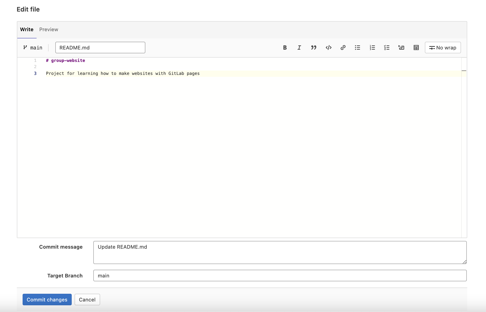
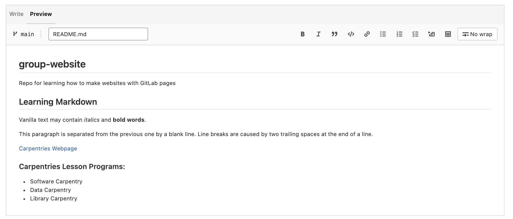

::::::::::::::::::::::::::::::::::::::: objectives

- create simple pages of formatted text

::::::::::::::::::::::::::::::::::::::::::::::::::

:::::::::::::::::::::::::::::::::::::::: questions

- How can I write content for my webpages?
- How do I link to other pages?

::::::::::::::::::::::::::::::::::::::::::::::::::

## Markdown

Markdown es un lenguaje de marcado ligero, es decir, una convención para añadir
información de estilo al contenido textual. Como su nombre indica, los elementos
sintácticos de este lenguaje se reducen al mínimo. Al tener una sintaxis más bien
minimalista, el texto formateado en Markdown es comparablemente legible. Esta puede ser
una de las razones por las que Markdown se ha convertido en el lenguaje preferido para
las entradas de usuario formateadas en sitios web como, por ejemplo:

- [Stack Exchange](https://stackexchange.com/)
- [GitLab](https://about.gitlab.com/)
- [GitHub](https://github.com/).

## ¿Dónde empezar a escribir Markdown?

Existen muchas herramientas para renderizar código fuente Markdown. La renderización es
el proceso de generar una vista agradable del contenido utilizando la información de
estilo incluida en el texto fuente. Es muy probable que tu editor pueda hacerlo. Como
estamos trabajando en la creación de sitios web utilizando páginas de GitLab,
utilizaremos GitLab directamente para aprender los fundamentos de Markdown. El proyecto
GitLab que creaste en el último episodio contiene un archivo `README.md`. Haz clic en el
nombre del archivo para acceder a él.

La siguiente imagen muestra la vista por defecto. Esta vista incluye una vista
renderizada del contenido dentro del archivo `README.md`, como la de la página principal
de nuestro proyecto.

{alt='README preview' .image-with-shadow width="900px" }

Los botones de la derecha permiten interactuar con el archivo y la visualización. El
primer par de botones, los que tienen los iconos, le permiten cambiar entre `Display source` y `Display rendered file`. Pase con el ratón sobre ellos para mostrar estos dos
mensajes en tooltips. La fuente es la vista no renderizada de nuestro archivo. Podemos
editarla a través del botón azul `Edit`. Haga clic en él.

{alt='Interfaz de edición del archivo README de los sitios web degrupo' .image-with-shadow width="900px" }

Podemos cambiar el contenido y echar un vistazo a la vista renderizada haciendo clic en
la pestaña `Preview` de la parte superior.

{alt='Vista previa del contenido renderizado del archivo README de los sitios web delgrupo' .image-with-shadow width="900px" }

Añadamos `Some **bold** font` y veamos qué pasa cuando lo previsualizamos usando la
pestaña de previsualización. ¿Qué ha pasado con la negrita del mundo?

Para guardar el contenido en el archivo `README.md`, debemos hacer clic en el botón
`Commit changes` en la parte inferior de la página. Atención: no se trata de un simple
botón de "Guardar", sino de un commit real. Esta versión del proyecto se almacenará en
git con el `Commit message` que especificaremos en el menú de commit aquí y en la rama
que establezcamos como `Target branch`. Sólo tenemos la rama principal por el momento -
por lo que la elección es obvia - y el mensaje de confirmación está precompilado con el
nombre del archivo que acabas de editar. Es posible que desee ser más específico en su
mensaje de confirmación, pero por el momento vamos a ir con la opción por defecto
proporcionada. Confirme este cambio.

:::::::::::::::::::::::::::::::::::::::::  callout

### Escribiendo un mensaje de confirmación

Un mensaje de confirmación es un comentario corto, descriptivo y específico que nos
ayudará a recordar más tarde qué hicimos y por qué. Encontrarás más información sobre
cómo escribir un mensaje de confirmación en [esta
sección](https://swcarpentry.github.io/git-novice/04-changes/index.html) de la lección
de Git-novice.

::::::::::::::::::::::::::::::::::::::::::::::::::

{alt='After commiting README changes' 
.image-with-shadow width="900px" }

La interfaz te redirige a la página principal del proyecto. En la parte superior, un
mensaje dice "Your changes have been successfully committed" Nuestros cambios fueron
incluidos en el archivo README, que ahora muestra la segunda línea con la fuente en
negrita.

## Escribiendo Markdown

Ahora que ya conocemos la interfaz de edición y la pestaña de vista previa de nuestros
proyectos `README.md` podemos utilizarlo como editor de texto e investigar algunas
características de Markdown.

Nuestro `README.md` ya contiene texto y dos funciones de formato:

- Encabezado `# group-website`
- Énfasis usando `**bold**`.

Aprendamos un poco más de Markdown añadiendo algo de formato y veamos qué ocurre cuando
lo previsualizamos usando la pestaña de previsualización. Añade lo siguiente a tu
archivo `README.md`.

```markdown 
# group-website
Repo for learning how to make websites with GitLab pages

## Learning Markdown

Vanilla text may contain *italics* and **bold words**.

This paragraph is separated from the previous one by a blank line.
Line breaks
are caused by two trailing spaces at the end of a line.

[Carpentries Webpage](https://carpentries.org/)

### Carpentries Lesson Programs:
- Software Carpentry
- Data Carpentry
- Library Carpentry
```

> 
A continuación, puedes volver a hacer clic en la pestaña de vista previa para ver cómo
se muestra el formato.

{alt='Vista previa del formato añadido al README' 
.image-with-shadow width="900px" }

:::::::::::::::::::::::::::::::::::::::::  callout

### Los espacios finales de Markdown son significativos

En el ejemplo anterior hay dos espacios al final de `Line breaks `. Estos introducen
lo que se llama un **salto de línea duro**, haciendo que ese párrafo continúe en la
siguiente línea añadiendo un `<br/>` al HTML generado.

Si rompes la línea en un archivo markdown pero no incluyes los dos espacios finales,
el HTML generado continuará en la misma línea **sin** introducir un `<br/>`. Esto se
denomina **salto de línea suave**.

En algunos casos puedes encontrar que los **saltos de línea suaves** introducen un
`<br/>`. Esto puede ocurrir cuando se utilizan diferentes [sabores
markdown](#sabores-markdown). {: .language-markdown }

::::::::::::::::::::::::::::::::::::::::::::::::::

Puedes confirmar estos cambios para guardarlos. Pero primero, vamos a hacer un ejercicio
para probar a escribir más markdown.

::::::::::::::::::::::::::::::::::::::  challenge

### Ejercicio: Probar Markdown

Usa [this cheatsheet][gitlab-flavored-markdown] para añadir lo siguiente a tu
`README.md`:

- Otro encabezado de segundo nivel
- Algún texto bajo ese encabezado de segundo nivel que incluye un enlace y texto
  ~~tachado~~.
- Un encabezado de tercer nivel
- Una lista numerada
- Bonus: Añadir esta imagen
  <https://github.com/carpentries/carpentries.org/blob/main/images/TheCarpentries-opengraph.png>

> ### Ejemplo de solución
> 
> Por ejemplo, tu markdown podría tener el siguiente aspecto:
> 
> ```markdown 
> ## More info on the lesson
> You can find this lesson [here](https://grp-bio-it-workshops.embl-community.io/building-websites-with-gitlab/).
> 
> ### Four reasons you should learn Markdown:
> 
> 1. Less formatting than HTML
> 2. Easy to read even with formatting
> 3. Commonly used for websites and software development
> 4. We ~~don't~~ use it in The Carpentries
> 
> 
> ```

::::::::::::::::::::::::::::::::::::::::::::::::::

:::::::::::::::::::::::::::::::::::::::::  callout

### Enlaces de estilo de referencia

Hasta ahora, hemos utilizado enlaces *inline-style* que tienen la URL en línea con el
texto de la descripción, por ejemplo:

```markdown 
[Carpentries Webpage](https://carpentries.org/)
```

Si utilizas un enlace más de una vez, considera la posibilidad de utilizar los
llamados enlaces de estilo *referencia*. Los enlaces de tipo referencia hacen
referencia a la URL mediante una etiqueta. La etiqueta va entre corchetes `[ ]` justo
después del texto de descripción del enlace y después, normalmente al final de la
página, puede conectar esa etiqueta a la url a la que hace referencia para completar
el enlace. Esto se parece a:

```markdown 
[Carpentries Webpage][carpentries]

[carpentries]: https://carpentries.org/
```

::::::::::::::::::::::::::::::::::::::::::::::::::

Seguiremos utilizando Markdown y aprendiendo más a lo largo del resto de la lección.
Tanto si decides estructurar tu sitio web mediante tecnologías basadas en Markdown como
en HTML, seguirás necesitando conocer algunos conceptos básicos de Markdown para editar
tu archivo README. El archivo README proporcionará una guía esencial -que se mostrará en
la página de inicio de tu proyecto- para tus colaboradores y también para que tú
entiendas de qué trata el proyecto y cómo contribuir.

:::::::::::::::::::::::::::::::::::::::::  callout

### Sabores de Markdown

La descripción inicial de Markdown era informal y contenía ciertas ambigüedades, por
lo que a lo largo de los años aparecieron [diferentes implementaciones de Markdown y
variaciones
sintácticas](https://github.com/commonmark/commonmark-spec/wiki/markdown-flavors) (a
menudo denominadas "sabores") para soportar diversas características y extensiones
sintácticas. Como consecuencia, la sintaxis de una variante puede no interpretarse
como se espera en otra - hay que ser consciente de cuál está siendo utilizada por una
plataforma concreta. Estas son algunas de las variantes más conocidas:

- [GitLab-flavored Markdown][gitlab-flavored-markdown] (utilizado en esta lección y
  por GitLab)
- [GitHub-flavored Markdown][github-flavored-markdown] (utilizado por GitHub)
- [Kramdown][kramdown] (una implementación rápida, en Ruby y de código abierto
  publicada bajo la licencia MIT)

Mardown es también el lenguaje de la plataforma de notas colaborativas disponible en
el EMBL. Puede acceder a ella [aquí](https://pad.bio-it.embl.de/). La plataforma está
basada en [CodiMD](https://github.com/hackmdio/codimd).

::::::::::::::::::::::::::::::::::::::::::::::::::

::::::::::::::::::::::::::::::::::::::  challenge

### Ejercicio: Añade los detalles de tu repositorio a CodiMD

Utiliza la sintaxis Markdown para añadir un enlace en el documento de notas
colaborativas que estás utilizando para seguir esta lección. El texto del enlace debe
ser tu nombre de usuario de GitLab, y el objetivo tu repositorio.

::::::::::::::::::::::::::::::::::::::::::::::::::


[gitlab-flavored-markdown]: https://docs.gitlab.com/ee/user/markdown.html
[github-flavored-markdown]: https://github.com/adam-p/markdown-here/wiki/Markdown-Cheatsheet
[kramdown]: https://kramdown.gettalong.org/


:::::::::::::::::::::::::::::::::::::::: keypoints

- Markdown is an relatively easy way to write formatted text
- Markdown and HTML tags can be used together in a single page
- I recommend writing Markdown links 'reference-style'
- The landing page for a website is conventionally named `index.md`

::::::::::::::::::::::::::::::::::::::::::::::::::


